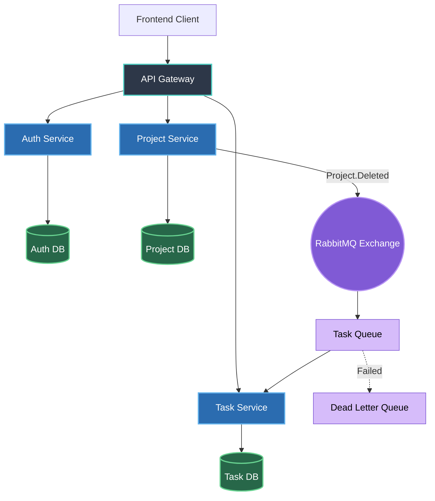
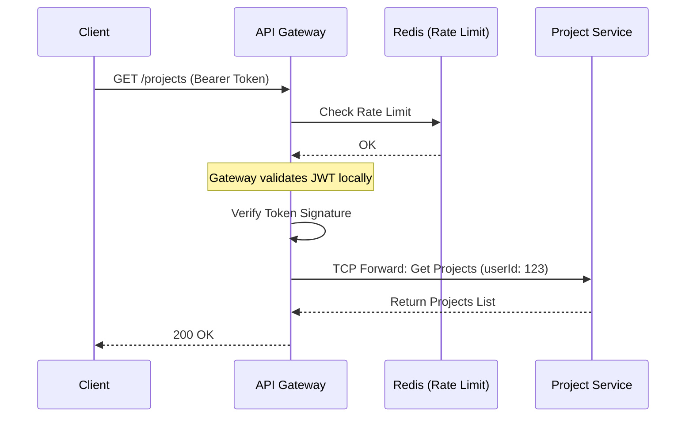
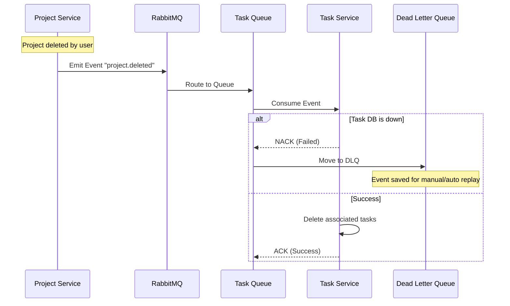

# TeamBoard: Microservice Migration Guide

This document outlines the step-by-step engineering plan to migrate the current TeamBoard modular monolith into a fully distributed microservice architecture.

## 1. Architectural End-State

The target architecture utilizes an API Gateway for ingress traffic, synchronous TCP for immediate reads, and RabbitMQ for resilient, asynchronous event handling.

---

## 2. Step-by-Step Migration Plan

Because our current codebase already uses isolated modules and `TasksClient`/`ProjectsClient` for cross-boundary communication, we do not need to rewrite the business logic. We only need to adjust the infrastructure layer.

### Phase 1: Establish the API Gateway
Currently, the HTTP routes (e.g., `POST /projects`, `GET /tasks`) are attached directly to the services.
1. **Action:** Create a new NestJS application named `GatewayService`.
2. **Action:** Move all standard HTTP Controllers (`ProjectsController`, `TasksController`, `AuthController`) from the backend into the `GatewayService`.
3. **Action:** Implement global middleware in the Gateway:
   - **Rate Limiter:** Add `@nestjs/throttler` backed by Redis to prevent API abuse.
   - **JWT Validation:** Move `JwtAuthGuard` to the Gateway. The Gateway will validate the token signature before forwarding requests to the microservices.

### Phase 2: Separate the Databases
Currently, all services share the `teamboard` MongoDB database.
1. **Action:** In the Docker Compose file, configure three separate logical databases.
2. **Action:** Update the Mongoose imports in the microservices so they connect to their respective databases:
   - Auth Service -> `mongodb://localhost:27017/teamboard_auth`
   - Project Service -> `mongodb://localhost:27017/teamboard_projects`
   - Task Service -> `mongodb://localhost:27017/teamboard_tasks`

### Phase 3: Introduce RabbitMQ (Event Broker)
Currently, `ProjectsService` directly calls `TasksClient.deleteByProject` over synchronous TCP when a project is deleted.
1. **Action:** Install `@nestjs/microservices` RabbitMQ transporter.
2. **Action:** Replace `InternalTcpClientFactory` with the RabbitMQ client.
3. **Refactor Flow:**
   - Instead of calling a deletion method, `ProjectService` emits an event: `this.client.emit('project.deleted', { projectId })`.
   - `TaskService` uses `@EventPattern('project.deleted')` to listen for the event and independently clear out orphaned tasks.
4. **Action:** Configure a **Dead Letter Exchange (DLX)** in RabbitMQ so that if `TaskService` crashes while deleting tasks, the message is saved for a replay.

---

## 3. Request Lifecycle Flows

### Token Validation & Sync Flow
This is how a standard API request will be routed through the new API Gateway.

### Asynchronous Event & DLQ Flow
This illustrates how we handle resilient background jobs using RabbitMQ.

## 4. Deployment Strategy

Once split, the deployment pipeline will look like this:
1. **API Gateway:** Deployed on Render/Railway. Exposed to the public internet.
2. **Microservices (Auth, Project, Task):** Deployed on internal networks (Private Services on Render). Only accessible via the Gateway or RabbitMQ. Not exposed to the internet.
3. **RabbitMQ / Redis / MongoDB:** Hosted on managed services like CloudAMQP, Upstash, and MongoDB Atlas.
